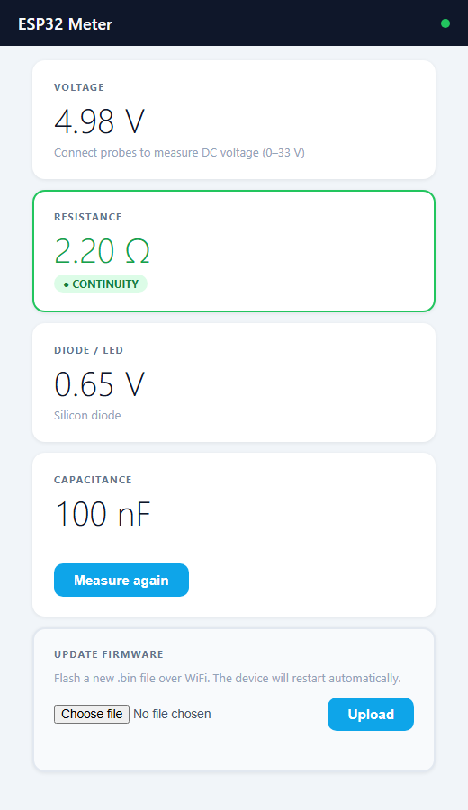
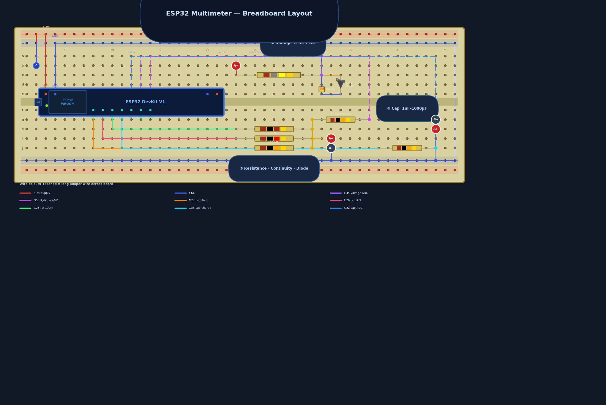

# ESP32 Meter

A WiFi-served multimeter for beginners. Flash the firmware, connect to the device's WiFi, and measure components in your browser — no app, no accounts, no configuration.

Designed as a cheap, hands-on introduction to electronics: buy a handful of resistors, a Zener diode, and a bag of crocodile clips. Wire it up on a breadboard, flash it once, and start identifying components.

---

> **⚠️ Status: untested hardware.** The breadboard circuit and firmware are a design that has not yet been built or verified on real hardware. Treat the schematic and GPIO assignments as a starting point, not a proven reference — double-check voltages and resistor values before trusting a measurement. Contributions and build reports welcome.

---

## What it measures

| Function | Range |
|----------|-------|
| DC Voltage | 0 – 33 V |
| Resistance | ~1 Ω – 1 MΩ (auto-ranging) |
| Continuity | below 50 Ω (highlighted in green) |
| Diode Vf | identifies silicon, Schottky, and LED types |
| Capacitance | ~5 nF – 1000 µF (RC timing method, press Measure) |

Does **not** measure: AC voltage, current, inductance, or anything above 33 V DC.



*The web interface, rendered with sample readings (hardware not yet verified — see status note above).*

---

## Hardware

**Board:** ESP32-C3 Mini (~£3 shipped).

**Bill of materials (total ~£5–8):**

| Qty | Component | Value |
|-----|-----------|-------|
| 1 | Resistor | 180 kΩ |
| 1 | Resistor | 20 kΩ |
| 1 | Resistor | 10 kΩ (×2, ADC protect + cap charge) |
| 1 | Resistor | 1 kΩ |
| 1 | Resistor | 100 Ω |
| 1 | Zener diode | 3.6 V (e.g. BZX55C3V6) |
| 1 | Capacitor | 100 nF (decoupling) |
| 2 | Crocodile clip leads | red + black |

All available from AliExpress, Amazon, or any electronics supplier.

**GPIO assignments (ESP32-C3):**

| GPIO | Function |
|------|----------|
| 0 | Voltage divider sense |
| 1 | Resistance / continuity / diode sense |
| 2 | Capacitance sense |
| 3 | Drive 100 Ω reference |
| 4 | Drive 1 kΩ reference |
| 5 | Drive 10 kΩ reference |
| 6 | Capacitor charge |

**Breadboard layout:**



See `docs/esp32-multimeter-brief.md` for full circuit diagrams and component-level detail.

---

## Getting started

### 1. Prerequisites (first time only)

```
arduino-cli core install esp32:esp32
```

### 2. Build and flash

```
build.bat             compile only
build.bat COM5        compile + flash (replace COM5 with your port)
```

### 3. Connect

1. On your phone or laptop, connect to WiFi: **ESP32Meter_XXXX** (no password)
2. Your device should automatically open the meter page. If not, open a browser and go to **http://192.168.4.1/**
3. Connect the crocodile clip probes to the component you want to measure

> **Phone tip:** turn off mobile data before connecting, otherwise the phone may stay on 4G instead of using the device's WiFi.

---

## Project structure

```
firmware/
  esp32meter/
    esp32meter.ino    setup / loop — WiFi AP, captive portal
    config.h          pin assignments, constants
    measure.h/.cpp    measurement functions
    webui.h/.cpp      HTML page, web server routes
  build/              compiled binaries (gitignored)

docs/
  esp32-multimeter-brief.md         full circuit design and firmware spec
  esp32-multimeter-breadboard.png   breadboard wiring layout
  esp32-multimeter-interface.png    web interface preview

build.bat             compile + flash script
```

---

## Version history

| Version | Notes |
|---------|-------|
| 1.0.0 | Initial release — voltage, resistance, continuity, diode, capacitance |
